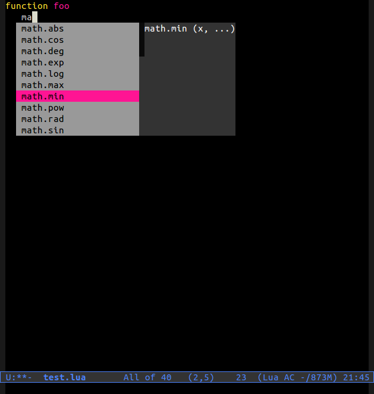

Perform auto-completion on Lua files inside Emacs using the
auto-complete library.

# Installation #

To install add the file `auto-complete-lua.el` in your load-path and
then add the following to your .emacs:

   (require 'auto-complete-lua)
   (add-hook 'lua-mode-hook '(lambda ()
                               (setq ac-sources '(ac-source-lua))
                               (auto-complete-mode 1)))
 

# Screenshot #

